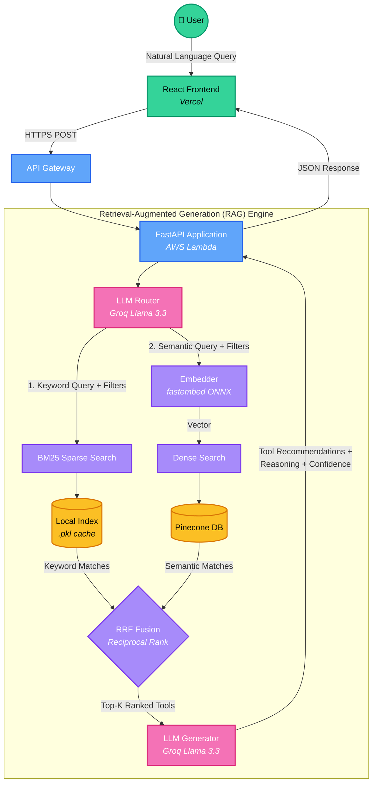
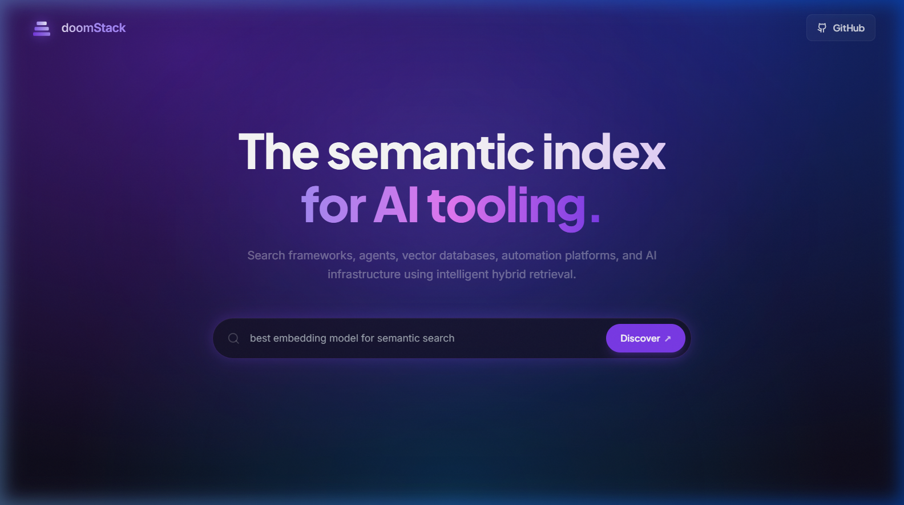

# doomStack — AI Tools Directory

> Discover the right AI tool for any job. Powered by hybrid search and LLM-generated recommendations.

**[Live Demo](https://hybrid-rag-five.vercel.app)** · **[API](https://ijjedtz7y5.execute-api.ap-south-1.amazonaws.com/health)**

---

## What is doomStack?

doomStack is an AI-powered directory that helps you find the best AI tools for your use case. Instead of guessing keywords, you describe what you want to do in plain English and doomStack finds, ranks, and explains the best matches.

**Try it:** *"free tool for building AI agents"* or *"open-source vector database"*

---

## How It Works

## Screenshot

---
## Tech Stack

| Layer | Tech |
|---|---|
| Frontend | React + Vite + TypeScript, deployed on **Vercel** |
| Backend | FastAPI, deployed on **AWS Lambda** |
| Search | Pinecone (vector) + BM25 (keyword) + RRF fusion |
| LLM | Groq — Llama 3.3 70B |
| Embedding | `BAAI/bge-small-en-v1.5` via fastembed (ONNX) |

---

## RAG Pipeline Evaluation

We evaluate the performance of the RAG pipeline using **Ragas** with an LLM-as-a-judge (Google Gemini). The evaluation is run locally against a dataset of predefined test queries and ground-truth answers.

The evaluator measures the pipeline across four key attributes:
- **Faithfulness:** Measures if the generated answer is factually consistent with the retrieved contexts (checks for hallucinations).
- **Answer Relevancy:** Measures how well the generated answer directly addresses the user's original query.
- **Context Precision:** Measures whether the most relevant contexts were ranked higher in the retrieval results.
- **Context Recall:** Measures if the retrieved contexts successfully capture all the information needed to match the ground-truth answer.

---

## Challenges We Faced

**1. Hybrid search result merging**
Dense (cosine similarity) and BM25 scores are on completely different scales and can't be directly compared. Solved with Reciprocal Rank Fusion (RRF) — rank-based merging that works regardless of score magnitude.

**2. BM25 state in a stateless Lambda**
BM25 requires a pre-built index that can't live in Pinecone. Solved by serializing it as a `.pkl` file and baking it into the Docker image so Lambda loads it from disk on cold start.
---
