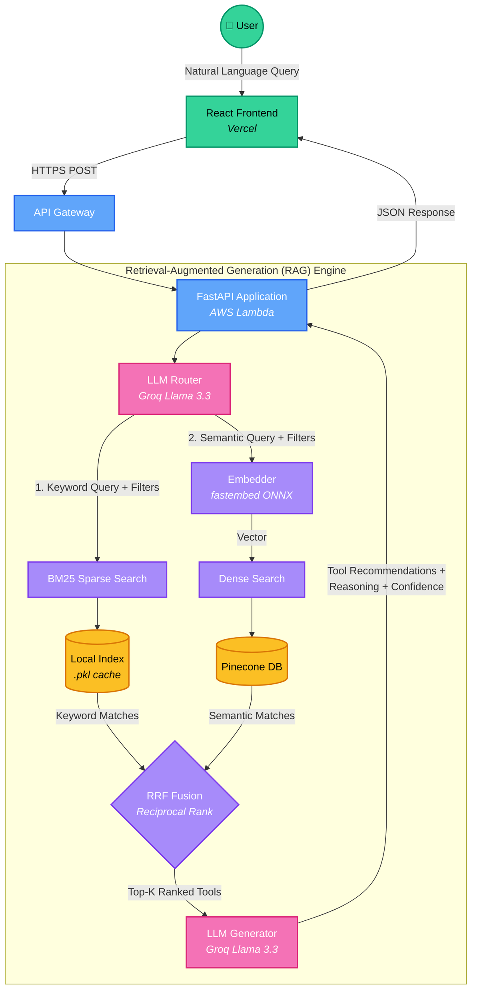

# doomStack — AI Tools Directory

> Discover the right AI tool for any job. Powered by hybrid search and LLM-generated recommendations.

**[Live Demo](https://hybrid-rag-five.vercel.app)** · **[API](https://ijjedtz7y5.execute-api.ap-south-1.amazonaws.com/health)**

---

## What is doomStack?

doomStack is an AI-powered directory that helps you find the best AI tools for your use case. Instead of guessing keywords, you describe what you want to do in plain English and doomStack finds, ranks, and explains the best matches.

**Try it:** *"free tool for building AI agents"* or *"open-source vector database"*

---

## How It Works




## Screenshot


---
## Tech Stack

| Layer | Tech |
|---|---|
| Frontend | React + Vite + TypeScript, deployed on **Vercel** |
| Backend | FastAPI, deployed on **AWS Lambda** |
| Search | Pinecone (vector) + BM25 (keyword) + RRF fusion |
| LLM | Groq — Llama 3.3 70B |
| Embedding | `BAAI/bge-small-en-v1.5` via fastembed (ONNX) |

---

## Running Locally

### Backend

```bash
python -m venv rag
.\rag\Scripts\activate

pip install -r requirements.txt
cp .env.example .env   # fill in your API keys

uvicorn app.main:app --reload
# → http://localhost:8000
```

### Frontend

```bash
cd frontend
npm install
cp .env.example .env   # set VITE_API_BASE to your backend URL

npm run dev
# → http://localhost:5173
```

---

## Environment Variables

Copy `.env.example` → `.env` and fill in:

| Variable | Description |
|---|---|
| `PINECONE_API_KEY` | Pinecone project API key |
| `GROQ_API_KEY` | Groq API key |
| `GOOGLE_API_KEY` | Google API key |

For the frontend, set `VITE_API_BASE` in `frontend/.env`.

---

## Adding New Tools

```bash
# Add tools from a JSON file
python -m pipeline.merge --new new_tools.json

# Push to search index (no redeploy needed)
python -m pipeline.ingest --mode incremental
```


## RAG Pipeline Evaluation

We evaluate the performance of the RAG pipeline using **Ragas** with an LLM-as-a-judge (Google Gemini). The evaluation is run locally against a dataset of predefined test queries and ground-truth answers.

The evaluator measures the pipeline across four key attributes:
- **Faithfulness:** Measures if the generated answer is factually consistent with the retrieved contexts (checks for hallucinations).
- **Answer Relevancy:** Measures how well the generated answer directly addresses the user's original query.
- **Context Precision:** Measures whether the most relevant contexts were ranked higher in the retrieval results.
- **Context Recall:** Measures if the retrieved contexts successfully capture all the information needed to match the ground-truth answer.

---

## Challenges We Faced

**1. Lambda image size vs. embedding model**
Running `sentence-transformers` inside Lambda pulled in PyTorch (~1.5 GB). Switched to `fastembed` which uses ONNX Runtime instead — no GPU, no PyTorch, image dropped to a manageable size.

**2. Cold start latency**
The ONNX embedding model was downloading on every Lambda cold start (5–8s delay). Fixed by pre-warming it at Docker build time so the model is baked into the image and loads instantly.

**3. Python 3.13 dependency conflicts**
`numpy<2.0.0` had no wheel for Python 3.13, and `fastembed==0.4.2` explicitly blocked 3.13. Had to loosen version constraints across numpy, fastembed, and langchain to get a working resolution.

**4. Hybrid search result merging**
Dense (cosine similarity) and BM25 scores are on completely different scales and can't be directly compared. Solved with Reciprocal Rank Fusion (RRF) — rank-based merging that works regardless of score magnitude.

**5. BM25 state in a stateless Lambda**
BM25 requires a pre-built index that can't live in Pinecone. Solved by serializing it as a `.pkl` file and baking it into the Docker image so Lambda loads it from disk on cold start.

**6. CORS between Vercel and API Gateway**
Vercel serves the frontend from a different origin than the API Gateway URL. Required explicit CORS middleware in FastAPI and matching headers configured in the API Gateway console.

---

